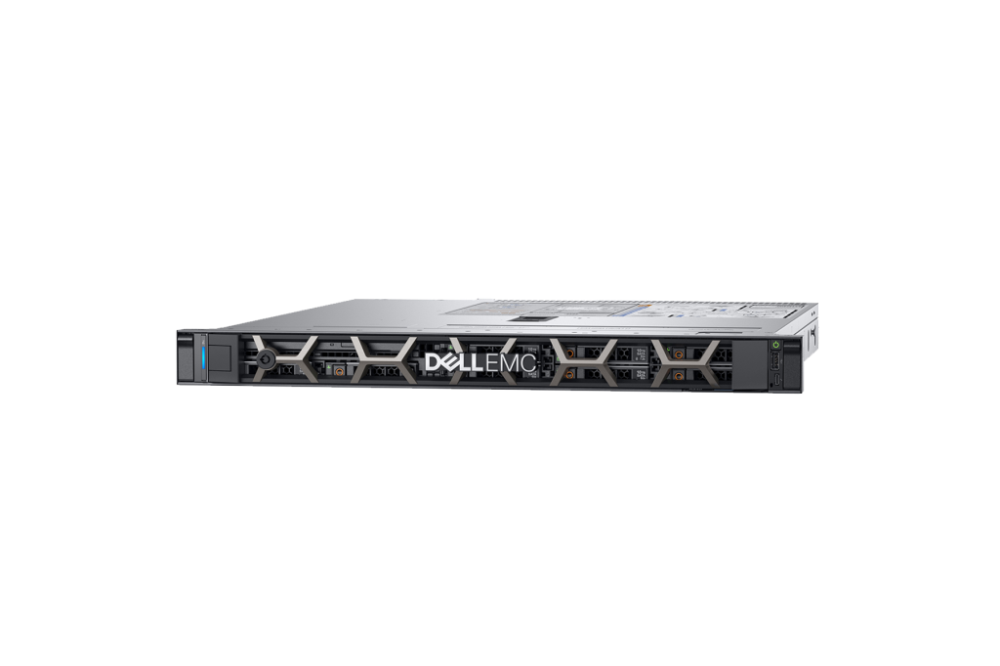
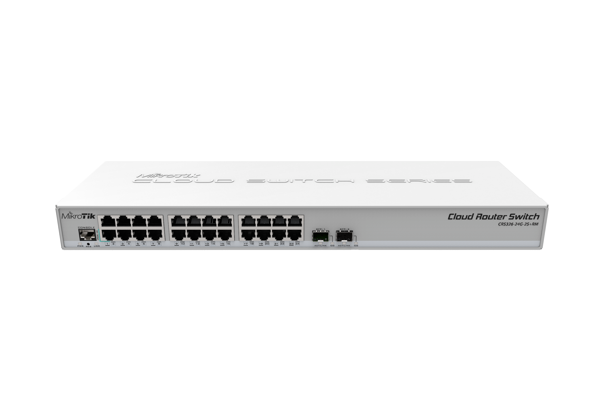

# Servers and Equipment

## 1. Servers

### Primary Server
- **Model**: Dell PowerEdge T340
- **CPU**: Intel Xeon E-2224
- **RAM**: 32 GB ECC RAM
- **Storage**:
  - 2x 1TB SSD (RAID 1) for operating system.
  - 4x 4TB HDD (RAID 5) for data storage.
- **Network Configuration**:
  - **IP Address**: 192.168.1.10
  - **MAC Address**: 00:1A:2B:3C:4D:5E
  - **VLAN**: Management (VLAN 10)
- **Role**: Hypervisor (Proxmox VE) running multiple virtual machines, including web server, database server, and internal services.

### Secondary Server (Optional)

<!--  -->

- **Model**: Intel NUC 10
- **CPU**: Intel Core i7-10710U
- **RAM**: 16 GB RAM
- **Storage**: 512GB NVMe SSD
- **Network Configuration**:
  - **IP Address**: 192.168.1.11
  - **MAC Address**: 00:1A:2B:3C:4D:5F
  - **VLAN**: Services (VLAN 20)
- **Role**: Backup server and test environment for lightweight services and development.

## 2. Storage Devices

### NAS (Network Attached Storage)
- **Model**: TrueNAS Core
- **CPU**: AMD Ryzen 5 3600
- **RAM**: 32 GB ECC RAM
- **Storage**:
  - 4x 6TB HDDs (RAID-Z configuration for redundancy)
  - 1x 1TB SSD for caching
- **Network Configuration**:
  - **IP Address**: 192.168.1.20
  - **MAC Address**: 00:1A:2B:3C:4D:60
  - **VLAN**: Storage (VLAN 30)
- **Role**: Centralized file storage for media, backups, and personal data. SMB/NFS shares for various services.

### Backup Storage
- **Model**: WD My Cloud 8TB External Drive
- **Storage**: 8TB (Single Drive)
- **Connection**: USB 3.0 to the primary server for daily backups.
- **Role**: Offline backups of critical data from VMs and services.

## 3. Networking Devices

#### CRS326-24G-2S+RM

[Product Page](https://mikrotik.com/product/CRS326-24G-2SplusRM)

| **Detail**                        | **Value**                       |
|-----------------------------------|----------------------------------|
| **Product code**                  | CRS326-24G-2S+RM                |
| **Architecture**                  | ARM 32bit                       |
| **CPU**                           | 98DX3236                        |
| **CPU core count**                | 1                               |
| **CPU nominal frequency**         | 800 MHz                         |
| **Switch chip model**             | 98DX3236                        |
| **Dimensions**                    | 443 x 144 x 44 mm               |
| **RouterOS license**              | 5                               |
| **Operating System**              | RouterOS / SwitchOS             |
| **Size of RAM**                   | 512 MB                          |
| **Storage size**                  | 16 MB                           |
| **Storage type**                  | FLASH                           |

### Switch
- **Model**: Ubiquiti UniFi 16-Port Managed Switch
- **Ports**: 16x Gigabit Ethernet
- **VLANs**:
  - VLAN 10: Management
  - VLAN 20: Services
  - VLAN 30: Storage
  - VLAN 40: Guest Network
- **Role**: Managed switch for internal network traffic, providing segmentation and quality of service (QoS) for different VLANs.

### Wireless Access Points
- **Model**: UniFi UAP-AC-PRO
- **Frequency**: Dual-band 2.4GHz and 5GHz
- **Network Configuration**:
  - **IP Address**: 192.168.1.50
  - **VLANs**:
    - VLAN 40: Guest Network
    - VLAN 20: Services (Wi-Fi for smart devices and IoT)
- **Role**: Provides Wi-Fi access for both the guest and internal network, supporting IoT devices and mobile devices.

---

## 4. Key Specifications Overview

| **Device**          | **CPU**               | **RAM**       | **Storage**                      | **IP Address**   | **MAC Address**     | **VLAN**         | **Role**                            |
|---------------------|-----------------------|---------------|----------------------------------|------------------|---------------------|------------------|--------------------------------------|
| **Primary Server**   | Intel Xeon E-2224     | 32 GB         | 2x 1TB SSD, 4x 4TB HDD (RAID 5)  | 192.168.1.10     | 00:1A:2B:3C:4D:5E   | VLAN 10 (Mgmt)    | Hypervisor for VMs                  |
| **Secondary Server** | Intel i7-10710U       | 16 GB         | 512GB NVMe SSD                   | 192.168.1.11     | 00:1A:2B:3C:4D:5F   | VLAN 20 (Services)| Backup/test environment             |
| **NAS**             | AMD Ryzen 5 3600      | 32 GB         | 4x 6TB HDD (RAID-Z)              | 192.168.1.20     | 00:1A:2B:3C:4D:60   | VLAN 30 (Storage) | Central file storage (SMB/NFS)      |
| **Router**          | Dual-Core MIPS64      | 1 GB          | N/A                              | 192.168.1.1      | 00:1A:2B:3C:4D:61   | VLAN Trunk        | Central network management          |
| **Switch**          | N/A                   | N/A           | N/A                              | Managed via VLAN | N/A                 | VLANs 10, 20, 30, 40 | Network traffic management          |
| **Access Point**    | N/A                   | N/A           | N/A                              | 192.168.1.50     | 00:1A:2B:3C:4D:62   | VLANs 20, 40      | Wireless access for devices         |
